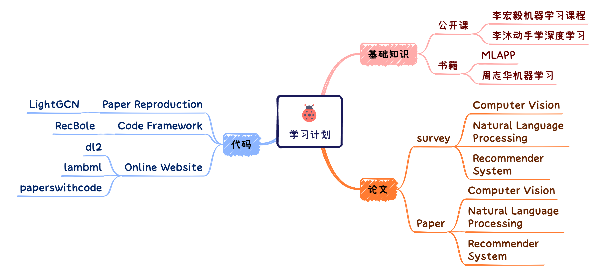

# 基础知识、论文、代码学习进度安排

## 学习任务

🔥🔥🔥 **基础知识**  
**[Course](https://arxiv.org/pdf/2306.13549.pdf)** | **[Book](./book)**

基础知识的学习包括两部分：网课和书籍。上述课程链接为 [李宏毅2021/2022春机器学习课程](https://www.bilibili.com/video/BV1Wv411h7kN/?spm_id_from=333.337.search-card.all.click)，书籍链接为本仓库中 [book](./book) 目录下整理的一些机器学习相关的电子版书籍。:sparkles:

优先学习李宏毅机器学习课程和mlapp两本书籍。大家也可根据自身需要学习其他课程和书籍。

**任务安排参考如下**：每周学习一节课程、每周阅读一章书籍。 :star2:

---

🔥🔥🔥 **经典论文**  
**[Survey](./paper/survey)** | **[Paper](./paper/paper)**

整理的论文包括以下几类：CV、NLP、RS、survey。具体的论文列表参考上述链接。 :sparkles:

整理的论文列表供大家参考，经典论文的阅读旨在提升论文阅读能力。大家也可根据自身需要搜索阅读感兴趣或与自身研究方向的论文。

**任务安排参考如下**：每周1~2篇论文。 :star2:

---

🔥🔥🔥 **代码能力**  
**[Paper Code](./code)** | **[Code Framework](./code)** | **[Online Website](./code)**

代码学习包含以下三部分：论文代码、代码框架、在线学习网站。经典论文的代码需要大家阅读理解后进行仿写，代码框架需要大家跑通并掌握整体流程，在线网站非常方便大家由浅入深的学习。 :sparkles:

除了仓库中供参考的这些代码之外，大家也可选择阅读一些具有开源代码的论文并复现，或参加比赛等。

**任务安排参考如下**：每1~2周复现一篇经典论文的代码，或每周在 dl2.ai 等网站上学习适量内容等。 :star2:

## 学习进度表

- **Content** 列分别记录每周分享的内容 ”课程、论文、书籍“
-    **Note**    列记录分享人员整理的笔记
-  **Sharer**   列是每周需要进行分享的人员，名称被加粗的负责组织本周的分享会

| Week  |                           Content                            |         Note         |           Sharer           |
| :---: | :----------------------------------------------------------: | :------------------: | :------------------------: |
| **1** | :star2:[机器学习规定](https://www.bilibili.com/video/BV1Wv411h7kN?p=3&vd_source=d7479f6f80547bcca48d3e2d18bd7178) :star2:[Video-ChatGPT: Towards Detailed Video Understanding via Large Vision and Language Models](https://arxiv.org/pdf/2306.05424.pdf) :star2:[Probability: Univariate Models](./book/Probabilistic Machine Learning.pdf) | [Link](./note/week1) |  **程恺**  郗浩宇  孔浩宇  |
| **2** | :star2:[机器学习规定](https://www.bilibili.com/video/BV1Wv411h7kN?p=3&vd_source=d7479f6f80547bcca48d3e2d18bd7178) :star2:[Video-ChatGPT: Towards Detailed Video Understanding via Large Vision and Language Models](https://arxiv.org/pdf/2306.05424.pdf) :star2:[Probability: Univariate Models](fffff) |    [Link](./note)    |  **俞睿泽**  王建程  程恺  |
| **3** | :star2:[机器学习规定](https://www.bilibili.com/video/BV1Wv411h7kN?p=3&vd_source=d7479f6f80547bcca48d3e2d18bd7178) :star2:[Video-ChatGPT: Towards Detailed Video Understanding via Large Vision and Language Models](https://arxiv.org/pdf/2306.05424.pdf) :star2:[Probability: Univariate Models](fffff) |    [Link](./note)    |  **吕航**  俞浩成  俞睿泽  |
| **4** | :star2:[机器学习规定](https://www.bilibili.com/video/BV1Wv411h7kN?p=3&vd_source=d7479f6f80547bcca48d3e2d18bd7178) :star2:[Video-ChatGPT: Towards Detailed Video Understanding via Large Vision and Language Models](https://arxiv.org/pdf/2306.05424.pdf) :star2:[Probability: Univariate Models](fffff) |    [Link](./note)    |  **俞浩成**  吕航  郗浩宇  |
| **5** | :star2:[机器学习规定](https://www.bilibili.com/video/BV1Wv411h7kN?p=3&vd_source=d7479f6f80547bcca48d3e2d18bd7178) :star2:[Video-ChatGPT: Towards Detailed Video Understanding via Large Vision and Language Models](https://arxiv.org/pdf/2306.05424.pdf) :star2:[Probability: Univariate Models](fffff) |    [Link](./note)    | **王建程**  俞睿泽  俞浩成 |
| **6** | :star2:[机器学习规定](https://www.bilibili.com/video/BV1Wv411h7kN?p=3&vd_source=d7479f6f80547bcca48d3e2d18bd7178) :star2:[Video-ChatGPT: Towards Detailed Video Understanding via Large Vision and Language Models](https://arxiv.org/pdf/2306.05424.pdf) :star2:[Probability: Univariate Models](fffff) |    [Link](./note)    |   **孔浩宇**  程恺  吕航   |
| **7** | :star2:[机器学习规定](https://www.bilibili.com/video/BV1Wv411h7kN?p=3&vd_source=d7479f6f80547bcca48d3e2d18bd7178) :star2:[Video-ChatGPT: Towards Detailed Video Understanding via Large Vision and Language Models](https://arxiv.org/pdf/2306.05424.pdf) :star2:[Probability: Univariate Models](fffff) |    [Link](./note)    | **郗浩宇**  孔浩宇  郗浩宇 |

